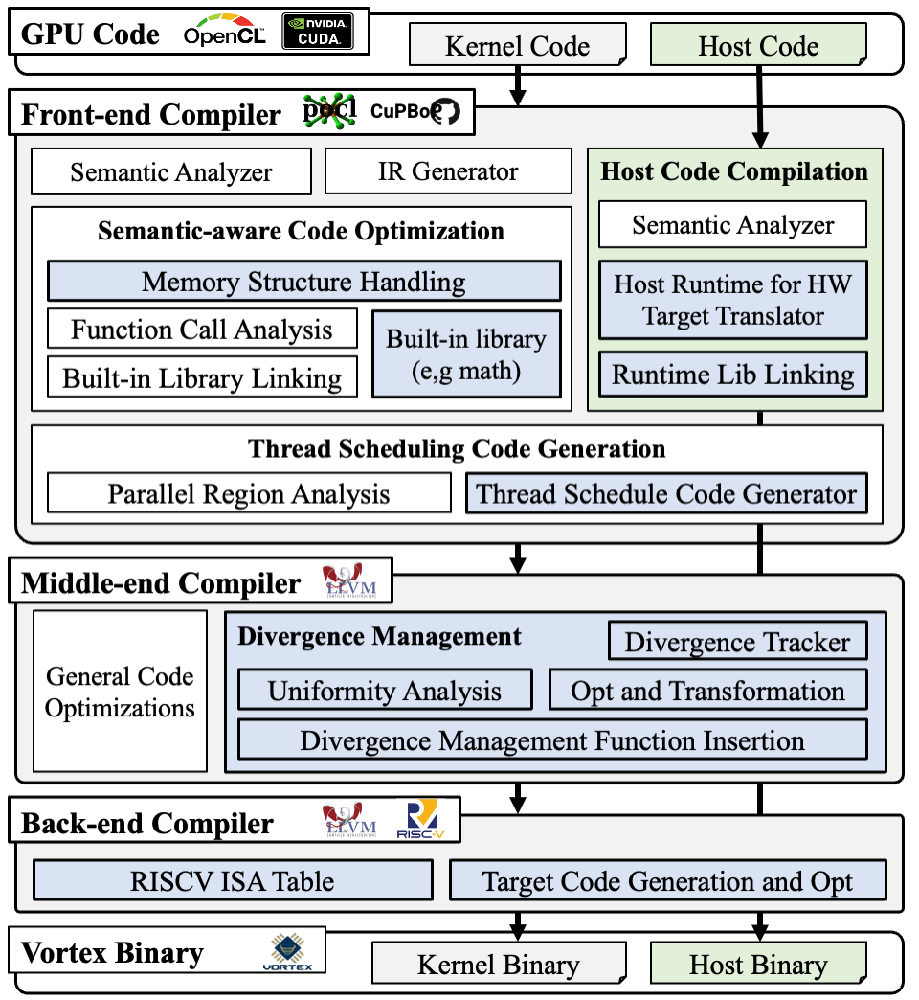

# Vortex-Optimized Light-weight Toolchain (VOLT)
Volt is an end-to-end, open-source compiler framework for the Vortex open-source GPU and its variants. It supports multiple front-end languages, including CUDA and OpenCL, by extending two open-source projects, PoCL and CuPBoP. Volt also extends LLVM to enable SIMT-aware IR-level optimizations for portability across GPU variants, and augments LLVM-RISC-V to provide full support for the Vortex ISA.



The figure shows an overview of Volt, with the modules extended or introduced by Volt highlighted in blue.

## Build Toolchain (Vortex v2, 64-bit)

### 1. Folder structure

```bash
<VOLT>
├── tools # location of libraries and bin files
│   ├── libc32
│   ├── libc64
│   ├── libcrt32
│   ├── libcrt64
│   ├── llvm-vortex
│   ├── pocl
│   ├── riscv32-gnu-toolchain
│   ├── riscv64-gnu-toolchain
│   ├── sv2v
│   ├── verilator
│   ├── vortex
│   └── yosys
├── pocl 
├── llvm-vortex
└── vortex
```

### 2. Set up folders

```bash
cd Volt
mkdir tools 
```

### 3. Make config file (add into bash file)

```bash
  export PRJ=<path-to-volt-folder>
  export TOOL_DIR=$PRJ/tools
  export VORTEX_PREFIX=$TOOL_DIR/vortex
  export LLVM_PREFIX=$TOOL_DIR/llvm-vortex
  export POCL_PREFIX=$TOOL_DIR/pocl
  source $PRJ/vortex/build/ci/toolchain_env.sh
```

### 4. Install vortex 

```bash
cd $PRJ/vortex
sudo ./ci/install_dependencies.sh
mkdir build && cd build

../configure --xlen=64 --tooldir=$TOOL_DIR --prefix=$VORTEX_PREFIX #setup 32bit
./ci/toolchain_install.sh --all # install prebuilt toolchain
source ./ci/toolchain_env.sh
make -s
make install
./ci/blackbox.sh --cores=2 --app=opencl/vecadd # test
```

### 5. Install llvm-vortex 

```bash
cd $PRJ
mv $LLVM_PREFIX $TOOL_DIR/llvm-vortex-prebuilt 
mkdir $TOOL_DIR/llvm-vortex

cd llvm
mkdir build && cd build

export RISCV_TOOLCHAIN_ELF_PATH=$PRJ/tools/riscv64-gnu-toolchain/riscv64-unknown-elf

cmake -G "Unix Makefiles" -DLLVM_ABI_BREAKING_CHECKS=FORCE_OFF -DLLVM_INCLUDE_EXAMPLES=OFF -DLLVM_INCLUDE_TESTS=OFF -DBUILD_SHARED_LIBS=True -DCMAKE_BUILD_TYPE=RelWithDebInfo -DLLVM_ENABLE_ASSERTIONS=ON -DLLVM_ENABLE_PROJECTS="clang" -DCMAKE_INSTALL_PREFIX=$LLVM_PREFIX -DDEFAULT_SYSROOT=$RISCV_TOOLCHAIN_ELF_PATH -DLLVM_DEFAULT_TARGET_TRIPLE="riscv64-unknown-elf" -DLLVM_TARGETS_TO_BUILD="X86;RISCV;NVPTX" ../llvm
make -j`nproc`
make install
```

### 6. Install pocl vortex

```bash
cd $PRJ/pocl
mkdir build && cd build

cmake -G "Unix Makefiles" \
  -DCMAKE_BUILD_TYPE=RelWithDebInfo \
  -DCMAKE_INSTALL_PREFIX=$POCL_PREFIX \
  -DPOCL_LLVM_CONFIG=$LLVM_PREFIX/bin/llvm-config \
  -DCLANG=$LLVM_PREFIX/bin/clang \
  -DENABLE_HOST_CPU_DEVICES=ON \
  -DENABLE_LLVM=ON \
  -DENABLE_VORTEX_DEVICE=ON ..

make -j`nproc`
make install
```

### 7. Install Cupbop
```bash
cd $PRJ/CuPBoP
export CuPBoP_PATH=pwd
export LD_LIBRARY_PATH=$CuPBoP_PATH/build/runtime:$CuPBoP_PATH/build/runtime/threadPool:$LD_LIBRARY_PATH

wget "https://dl.dropboxusercontent.com/scl/fi/m9ap1tiybau4zk720t2z7/cuda-header.tar.gz?rlkey=zmdpst5l66t48ywrbtkj426nu&st=luao6zy7" -O cuda-header.tar.gz
tar -xzf 'cuda-header.tar.gz'
cp -r include/R* runtime/threadPool/include/

$CuPBoP_PATH/CuPBoP_env_setup.sh
export VORTEX_ARCHITECTUE = 64                  # 64 if using 64-bit vortex
mkdir build && cd build
cmake .. -DLLVM_CONFIG_PATH=`which llvm-config` # need path to llvm-config
make 
```

Extend config file (add into bash file)

```bash
export RISCV_TOOLCHAIN=${TOOL_DIR}/riscv64-gnu-toolchain # Assume Vortex is setup with 64-bit RISC-V
export VORTEX_HOME= # VORTEX repo path
export CuPBoP_PATH= # CUPBOP repo path
export VORTEX_PATH=$VORTEX_HOME/build
export PATH=$LLVM_PREFIX/bin:$PATH
export LD_LIBRARY_PATH=$CuPBoP_PATH/build/runtime:$CuPBoP_PATH/build/runtime/threadPool:$LD_LIBRARY_PATH
export LD_LIBRARY_PATH=$CuPBoP_PATH/cuda-12.1/lib64:$LD_LIBRARY_PATH
export LD_LIBRARY_PATH=${LLVM_PREFIX}/lib:${LD_LIBRARY_PATH}
export LD_LIBRARY_PATH=${VORTEX_PATH}/runtime/:${LD_LIBRARY_PATH}
```
CuPBoP Running Test

```bash
cd ./exampless/cfd
./kjrun_llvm18.sh
```

## Test Toolchain

### 0. Test Benchmark Location for Each Pipeline 
- OpenCL to Vortex pipeline is in vortex/tests/opencl
- CUDA to Vortex pipeline is in cupbop/examples 

### 1. Test OpenCL Benchmarks with Thread Divergence Optimizations

```bash
cd $PRJ/tests/test_opencl_w_divergence_opt
./run_evaluation.sh
```

### 2. Test CuPBoP with ISA extensions
```bash
cd $PRJ/tests/test_cupbop
./run_isa_extensions.sh
```

### 3. Test CuPBoP with Memory Hierarchy Support and API Support
```bash
cd $PRJ/tests/test_cupbop
./run_mem_hierarchy.sh
```